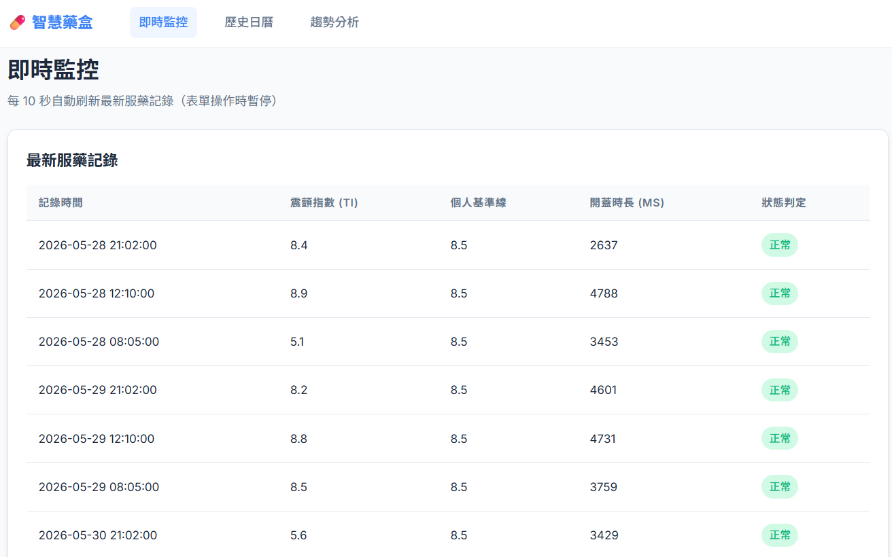
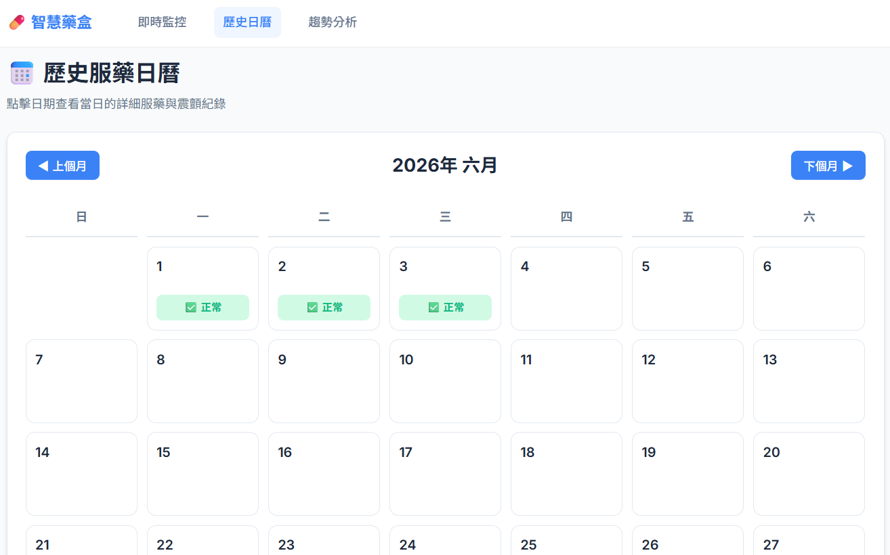
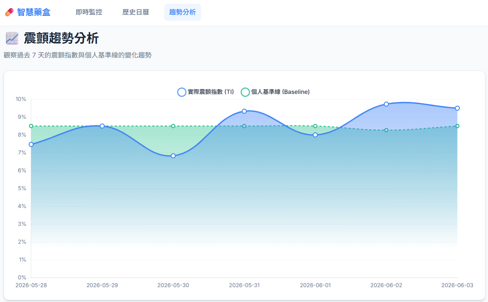

# 💊 智慧藥盒 (Smart Pill Box) Backend

這是一個 IoT 智慧藥盒專題的後端 API 伺服器，使用 Python Flask 建立，並搭配 SQLite 作為資料庫。此後端設計用於接收來自 ESP32 的感測器資料 (MPU-6050 震顫指數與開蓋時長)，並提供即時網頁儀表板供照顧者監控。支援異常震顫或超時未服藥的 LINE 官方帳號 (Messaging API) 通知。

## ✨ 功能特色

- **RESTful API**: 接收 ESP32 傳送的震顫數據與服藥狀態。
- **LINE Messaging API 整合**: 正常服藥、偵測到連續震顫趨勢異常 (TI > 基準線 1.5 倍)，或是「超時未服藥」時，自動發送對應的 LINE 訊息通知家屬。
- **LLM 人性化通知**: 震顫異常時可透過 OpenRouter LLM 將震顫指數、基準線與近期紀錄轉成溫和、適合家屬閱讀的繁體中文 LINE 通知。
- **個人化基準線與趨勢分析**: 系統會動態計算過去 7 天的平均震顫指數作為「基準線」，並提供獨立的 `/trend` 圖表分析頁面，視覺化呈現震顫指數與基準線的變化趨勢。
- **後端主動排程檢查**: 內建 `APScheduler` 背景任務，每分鐘主動比對預定時間與開蓋紀錄，精準判斷漏吃事件。
- **排程管理**: 提供 API 供 ESP32 同步預定服藥時間與超時判定條件。
- **歷史服藥日曆**: 提供月曆介面，以顏色視覺化標示每日服藥狀態（正常、漏吃、震顫異常），並可點擊查看詳細記錄。
- **自動化 SQLite 資料庫**: 自動建立所需的資料表 (`sensor_data` 與 `schedule`) 並處理版本遷移。

## 📸 畫面截圖 (Screenshots)

### 1. 即時監測儀表板
> 顯示近期的服藥紀錄、震顫指數以及目前的排程設定。



### 2. 歷史服藥日曆
> 透過月曆介面呈現長者每天的服藥狀態（正常、漏吃、震顫異常）。



### 3. 震顫趨勢分析
> 視覺化圖表呈現過去 7 天的平均震顫指數與基準線的變化趨勢，協助觀察長者健康狀況。



## 🛠️ 技術堆疊

- **後端框架**: Python Flask
- **資料庫**: SQLite3
- **環境變數**: python-dotenv
- **跨域處理**: flask-cors
- **硬體端預設環境**: ESP32 (Node32S), MPU-6050, 霍爾感測器, 蜂鳴器

## 🚀 快速開始

### 1. 安裝依賴套件

請確認您的環境中已安裝 Python 3，接著執行：

```bash
pip install flask flask-cors python-dotenv requests apscheduler
```

### 2. 設定環境變數

專案根目錄下有一個 `.env` 檔案，請在裡面填入您的 LINE Messaging API 與 OpenRouter 設定：

```env
LINE_TOKEN=your_line_channel_access_token_here
LINE_USER_ID=your_line_user_id_here
OPENROUTER_API_KEY=your_openrouter_api_key_here
LLM_MODEL=google/gemini-2.5-flash-lite
```

`OPENROUTER_API_KEY` 用於產生震顫異常時的人性化 LINE 通知文字；`LLM_MODEL` 可依 OpenRouter 可用模型調整。若未設定 OpenRouter API key，或 LLM API 暫時失敗，系統會自動 fallback 回原本固定格式通知，LINE 通知不會因此中斷。

LLM 只用於產生通知文字，不會取代原本的震顫異常判斷邏輯，也不會直接操作 SQLite 資料庫。系統仍由 Python 查詢並整理震顫資料摘要後，再交給 LLM 改寫成適合家屬閱讀的提醒。

### 3. 啟動伺服器

```bash
python app.py
```

伺服器將預設運行於 `http://0.0.0.0:5000`。
- 本地開發者請前往瀏覽器開啟：[http://localhost:5000](http://localhost:5000) 即可查看儀表板。
- 區域網路內的 ESP32 請發送請求至 `http://<您的電腦IP>:5000`。

## 📡 API 文件

### 1. 接收感測器資料
- **Endpoint**: `POST /api/sensor_data`
- **Content-Type**: `application/json`
- **Payload 範例**:
  - 紀錄: `{"tremor_index": 11.93, "duration_ms": 2100}`

### 2. 取得最近 30 筆歷史記錄
- **Endpoint**: `GET /api/logs`
- **回傳**: JSON 格式的歷史陣列資料。

### 3. 取得最近 7 天震顫趨勢
- **Endpoint**: `GET /api/tremor_report`
- **回傳**: `[{"date": "2024-01-01", "avg_ti": 12.3, "avg_baseline": 11.5}, ...]`

### 4. 取得/更新排程設定
- **Endpoint**: `GET /api/schedule` 
  - ESP32 開機時同步使用。
- **Endpoint**: `POST /api/schedule`
  - 網頁儀表板更新排程使用，格式：`{"times": ["08:00", "12:00", "21:00"], "timeout_min": 30}`

### 5. 取得歷史日曆資料
- **Endpoint**: `GET /api/calendar_data?year=2024&month=1`
- **回傳**: 依日期分組的服藥狀態與詳細記錄 (供網頁端月曆渲染使用)。
